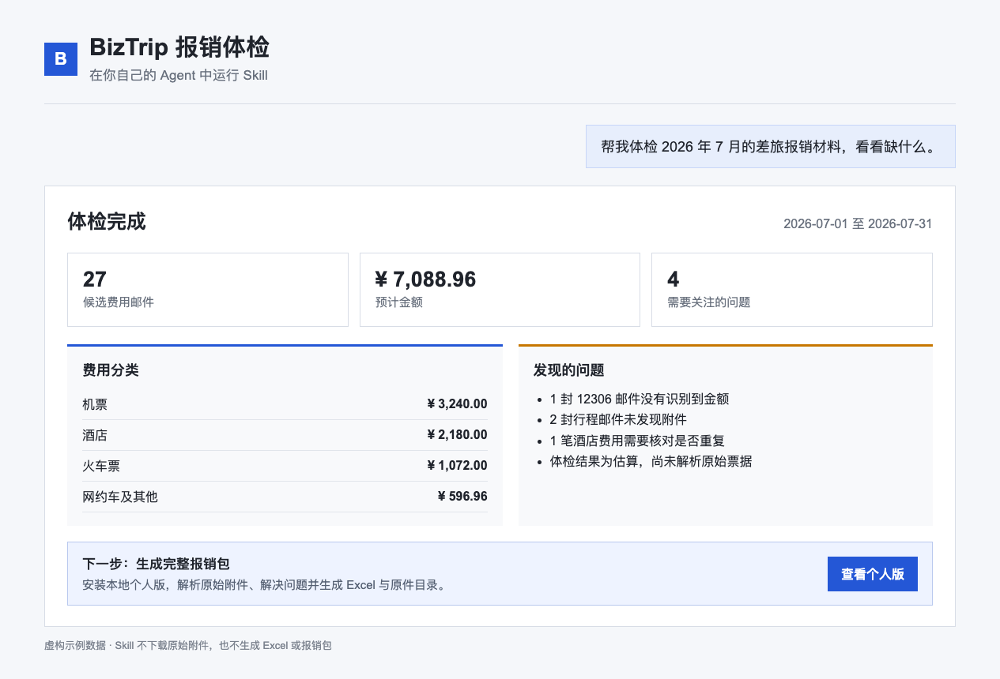
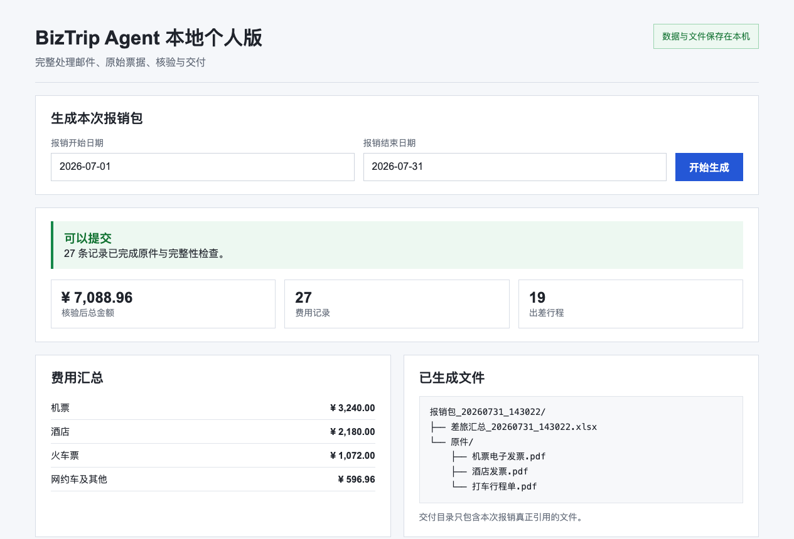
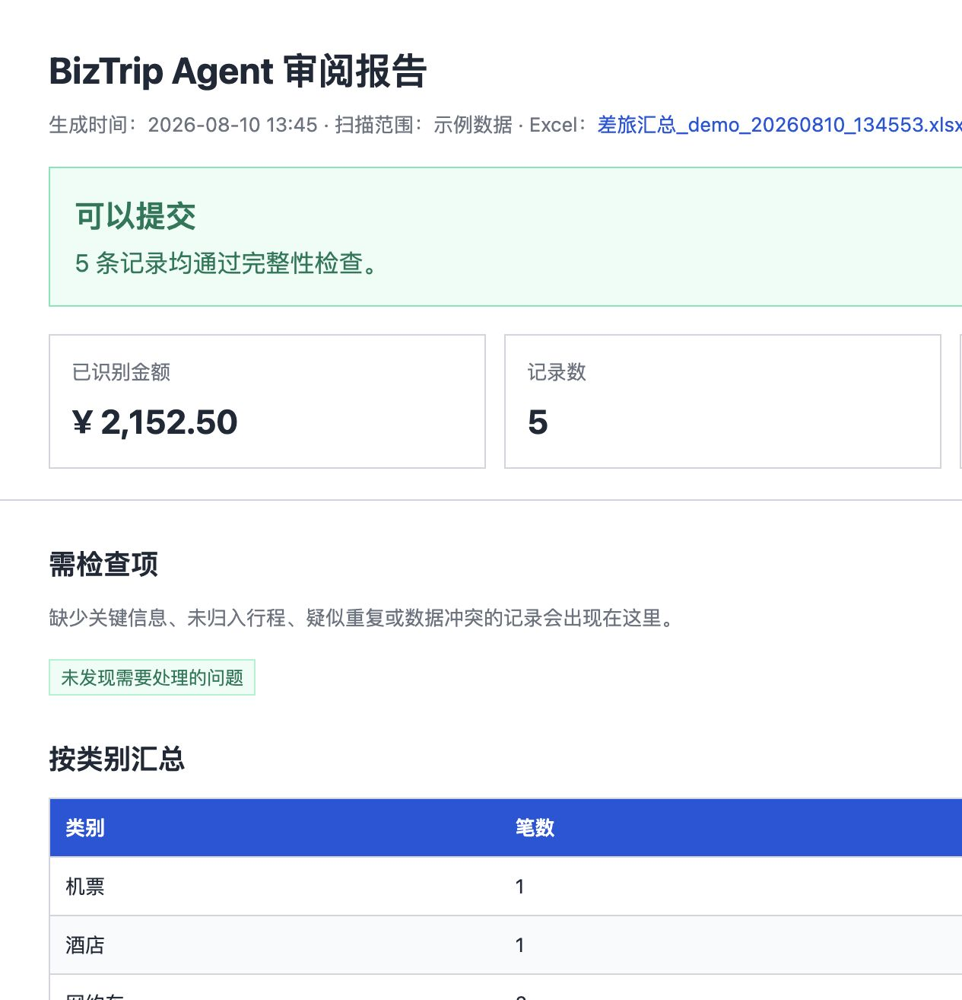

<div align="center">

# BizTrip Agent

**把散落在邮箱里的机票、酒店、火车票、打车和发票，整理成经过核验的差旅报销包。**

你只需要告诉自己的 Agent：

> 帮我体检上个月的差旅报销材料，看看缺什么。

BizTrip 会在本地收集凭证、识别费用、归并出差行程；发现缺失或冲突时先向你确认，全部通过后才交付 Excel 和报销原件。

**先用 Skill 复用现有 Agent 做体检，再安装本地个人版交付完整报销包。模型成本透明，不支付平台加价。**

<p>
  <a href="skills/biztrip-reimbursement/SKILL.md"><strong>安装开源 Skill</strong></a>
  ·
  <a href="#效果满意后安装本地测试版">下载本地测试版</a>
  ·
  <a href="https://github.com/Hao-Miracle/BizTrip-Agent/issues/new?template=professional_inquiry.yml">申请专业版</a>
</p>

<p>
  <a href="https://github.com/Hao-Miracle/BizTrip-Agent/actions/workflows/tests.yml">
    
  </a>
  
  
  <a href="https://github.com/Hao-Miracle/BizTrip-Agent/stargazers">
    
  </a>
</p>

</div>

---

## 两种使用方式，两种明确结果

以下截图由项目自带的虚构 Demo 数据生成，不包含真实邮箱、员工或票据信息。

### 1. 在自己的 Agent 中使用 Skill：先做报销体检

用户只需要说明时间范围。Skill 会给出候选费用、预计金额、分类和需要关注的问题，不下载原始附件，也不生成 Excel。

[](docs/assets/skill-audit-demo.png)

这一步用于快速判断材料是否值得继续整理。确认效果后，再进入本地个人版完成原始票据解析和正式交付。

### 2. 使用本地个人版：生成完整报销包

本地个人版提供独立工作台，用户选择报销时间后，系统解析邮件与原始附件、解决缺失和冲突，并完成提交前核验。

[](docs/assets/local-personal-demo.png)

核验完成后会明确显示“可以提交”或“暂不建议提交”，并生成 Excel 和本次真正引用的原件目录。

<details>
<summary>查看本地工作台和审阅报告完整长图</summary>

#### 本地工作台

[](docs/assets/workbench-demo.png)

#### 报销审阅报告

[](docs/assets/review-demo.png)

</details>

> 点击图片可以查看完整大图。Skill 展示的是体检结果；本地个人版展示的是完整处理与交付结果。

---

## 第一步：先用 Skill 尝试

BizTrip 的首选入口是开源薄 Skill：[`biztrip-reimbursement`](skills/biztrip-reimbursement/SKILL.md)。它把 BizTrip 接入支持 Skills 和本地脚本执行的 Agent，而不是要求你另外部署一套报销软件。

把下面的地址交给支持 Skills 的 Agent，并让它安装：

```text
https://github.com/Hao-Miracle/BizTrip-Agent/tree/main/skills/biztrip-reimbursement
```

安装后直接提出体检需求：

```text
帮我体检 2026 年 7 月的差旅报销材料，看看金额和凭证是否完整。
```

Skill 会：

1. 理解你要处理的时间范围。
2. 直接运行 Skill 自带的只读邮箱体检组件，不再下载完整引擎或安装依赖。
3. 只引导你在本地保存邮箱账号和授权码。
4. 复用你当前 Agent 已有的模型能力，不要求重复填写模型 API Key。
5. 汇总候选费用、预计金额和分类，并指出缺失金额或未发现附件的邮件。

Skill 不读取或展示邮箱授权码，不下载原始附件，也不生成 Excel 和原件包。它会把有限的邮件主题、发件人提示、附件名称和正文摘要交给用户当前 Agent 分析。详细边界见 [Agent Skill 使用指南](docs/skills.md)。

这一步用一份真实任务验证三件事：能发现多少费用、预计金额是否可信、缺失项是否有用。单次体检限制为最多 31 天或最近 60 封邮件，足够判断产品价值，又不会替代完整个人版。

需要生成 Excel、整理原件并完成提交前核验时，再使用本地个人版。个人版会保存配置、支持反复处理，并完成 Skill 刻意不提供的交付闭环。

---

## 为什么不是直接生成一张表

报销最危险的结果不是“没有结果”，而是得到一份看起来完整、实际有错误的表。

BizTrip 在交付前检查：

- 金额、日期和供应商是否完整有效。
- 每条费用是否有对应原件。
- 同一票据是否重复或存在编号冲突。
- 费用是否可靠归入某次出差。
- 行程日期和费用合计是否一致。

发现问题时，任务状态会停在“需要确认”；只有所有质量门槛通过后，系统才生成可提交的报销包。

---

## 安装个人版后，你最终得到什么

```text
报销包_20260731_143022/
├── 差旅汇总_20260731_143022.xlsx
└── 原件/
    ├── 机票电子发票.pdf
    ├── 酒店发票.pdf
    └── 打车行程单.pdf
```

Excel 包含：

| 工作表 | 内容 |
|---|---|
| **报销总览** | 行程、总金额和费用分类 |
| **费用明细** | 日期、金额、供应商、路线、订单号和原件 |
| **按供应商** | 各平台的笔数、金额和占比 |

交付目录只包含本次报销真正引用的文件。运行状态、附件缓存和内部 JSON 留在系统目录，不要求普通用户处理。

---

## 本地优先，数据去向由用户决定

- 邮箱通过标准 IMAP 读取，不发送、不删除、不修改邮件。
- 邮箱授权码和模型 API Key 只保存在用户本机。
- PDF、ZIP、Excel 和任务状态均保存在本地目录。
- Skill 不接收秘密配置，不替用户猜测财务数据。
- 模型负责理解邮件，规则引擎负责证据核验和故障兜底。

使用云端模型时，邮件正文片段和用于核验的票据文本会发送到用户自己配置的模型服务；原始附件和报销包仍保存在本地。需要数据完全不出本机时，应配置兼容 OpenAI 协议的本地模型。

支持 QQ、163、126、Gmail、Outlook 及其他标准 IMAP 邮箱。已覆盖 12306、去哪儿、携程、飞猪、航司邮件、酒店、滴滴、高德聚合打车、智慧发票、票根等常见来源。

---

## 效果满意后，安装本地测试版

先用 Skill 完成一次真实报销体检，确认识别结果和缺失项有价值后，可安装免费个人版生成完整报销包。配置只做一次，之后每次选择报销时间即可。Windows 和 macOS 使用同一套 Agent、核验规则和输出格式。

### Windows

当前提供未签名的 Windows 测试版，双击后打开本地 Web 工作台，不需要安装 Python 或 Git。它用于公开测试，不是未来唯一的产品形态。

[下载最新构建](https://github.com/Hao-Miracle/BizTrip-Agent/actions/workflows/windows-build.yml) · [查看 Windows 测试版说明](docs/windows-one-click.md)。Windows SmartScreen 可能要求用户确认运行。

### macOS

当前提供未签名、未公证的 macOS 测试版。下载并解压后打开 `BizTrip-Agent-Mac.app`，无需安装 Python 或 Git。

[下载最新构建](https://github.com/Hao-Miracle/BizTrip-Agent/actions/workflows/macos-build.yml) · [查看 macOS 测试版说明](docs/macos-test.md)。首次运行需要在 Finder 中按住 Control 点击应用并确认打开。

### Linux 和开发者

可以通过源码启动本地 Web 工作台，完整步骤见 [安装指南](docs/installation.md)。

---

## 第一次连接邮箱

本地页面会引导用户：

1. 在邮箱设置中开启 IMAP 服务。
2. 生成邮箱授权码或应用专用密码，不使用网页登录密码。
3. 在本地页面填写邮箱账号和授权码。
4. 选择本次报销的日期范围并开始生成。

系统会根据邮箱地址自动选择常见 IMAP 服务器。账号通常只需配置一次，页面不会回显授权码和 API Key。

---

## 两种低成本使用方式

通过 Skill 体检时，直接复用用户现有 Agent 的模型，不需要再次购买或配置模型。使用本地个人版生成完整报销包时，用户自行选择兼容 OpenAI 协议的模型服务，填写接口地址、API Key 和模型名称，不需要购买 BizTrip 的模型额度，也不承担中间平台加价。

模型负责理解复杂邮件和判断行程；本地规则负责提取兜底、证据核验、金额计算和提交门槛。模型失败或证据不足时，系统不会把未经核验的结果交付给用户。

这种组合把模型调用集中在真正需要理解的环节，避免重复调用和重复解析附件。实际费用由用户选择的模型、邮件数量和服务商定价决定。配置示例见 [.env.example](.env.example)。

---

## 第三步：需要团队能力时升级

当前仓库提供免费的开源 Skill 体检和单人本地个人版。Skill 帮助用户快速看见金额与材料缺口；个人版负责生成基础 Excel、整理原件并完成提交前核验。

专业版和企业版不会为基础 Excel 导出重复收费，而是解决个人本地版无法覆盖的组织问题：

- 企业报销制度和合规规则核验。
- 发票验真、异常检测和跨员工查重。
- 多员工、多邮箱、团队权限和审计记录。
- OA、ERP、财务系统及企业模板连接。
- 托管模型调用、自动更新、私有部署和技术支持。

当前开源版本不包含上述团队和企业能力。需要专业部署、企业规则接入、私有化或团队工作流，可以提交 [专业版申请](https://github.com/Hao-Miracle/BizTrip-Agent/issues/new?template=professional_inquiry.yml)。请勿在公开表单中填写员工信息、发票内容、邮箱授权码或 API Key。

---

## 开发者入口

安装项目命令：

```bash
python3 -m venv .venv
.venv/bin/python -m pip install -e ".[test]"
```

常用命令：

```bash
.venv/bin/biztrip web
.venv/bin/biztrip demo
.venv/bin/biztrip scan --start 2026-07-01 --end 2026-07-31
.venv/bin/python -m pytest
```

公开 Skill 使用自带的零依赖只读脚本，不需要安装完整 BizTrip 引擎，也不具备完整报销包交付能力。协议说明见 [Skill 结果结构](skills/biztrip-reimbursement/references/result-schema.md)。

### 项目结构

```text
BizTrip-Agent/
├── biztrip_agent/      本地任务、核验、交付、Web 和 Agent 接口
├── common/             邮件与通用解析能力
├── phase1/             规则解析流程
├── phase2/             Agent 模型理解与行程聚合
├── skills/             开源薄 Skill
├── tests/              本地与跨平台自动测试
└── docs/               安装、使用和常见问题
```

设计原则：

1. 数据准确是底线，模型不能绕过确定性核验。
2. 能删除的用户步骤先删除，再简化和自动化。
3. 核心引擎本地运行，Skill 只负责自然语言入口和任务编排。
4. 原始凭证可追溯，内部状态不污染用户交付物。
5. 新平台解析规则和缺陷修复欢迎通过 PR 贡献。

---

## 常见问题

**必须配置模型接口和 API Key 吗？**

分使用方式。Skill 体检复用你当前 Agent 的模型，只需配置邮箱；本地个人版要独立生成完整报销包，因此需要配置自己的接口地址、API Key 和模型名称。

**会修改邮箱里的邮件吗？**

不会。系统只读取邮件，不发送、不删除、不修改。

**为什么问题未解决时没有最终报销包？**

因为一份错误但看似完整的报销表比没有结果更危险。系统会保留内部审阅材料以便解决问题，但只有核验通过后才交付最终报销包。

**Windows 和 macOS 测试版需要另外购买模型额度吗？**

BizTrip 不销售或加价转售模型额度。测试用户使用自己选择的模型服务商，费用直接由服务商收取。

更多问题见 [FAQ](docs/faq.md)。

---

## 参与项目

- [报告问题](https://github.com/Hao-Miracle/BizTrip-Agent/issues/new?template=bug_report.md)
- [提出产品建议](https://github.com/Hao-Miracle/BizTrip-Agent/issues/new?template=feature_request.md)
- [查看更新日志](CHANGELOG.md)
- [阅读贡献指南](CONTRIBUTING.md)

如果 BizTrip 帮你减少了整理报销材料的时间，可以 Star 仓库，让更多需要它的人找到这个项目。

MIT License，详见 [LICENSE](LICENSE)。
